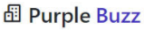

    

    

This landing page is a exercise for course B7WEB with focus in consolidate the base in HTML and CSS with flexbox.

## 🎴 Layout
The layout the project you find in: https://bit.ly/3Cn5egQ

## 🚀 Tecnologias utilizadas
- [HTML](https://developer.mozilla.org/en-US/docs/Web/HTML)
- [SASS](https://sass-lang.com/)
- [AnimateCSS](https://animate.style/)
